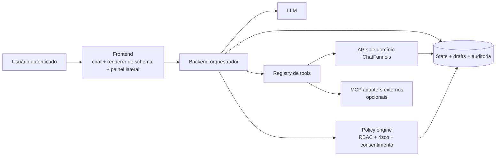
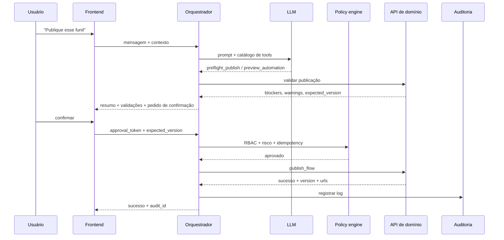
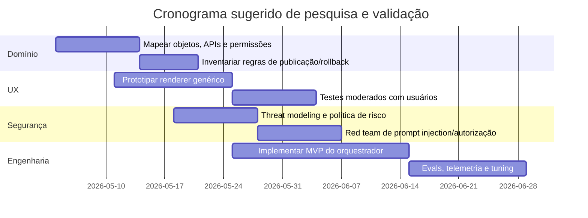

# Arquitetura recomendada para um chat agentic seguro e interativo no ChatFunnels

## Resumo executivo

O briefing descreve um objetivo claro: construir um chat com AI dentro do painel do ChatFunnels capaz de criar, editar, configurar e gerenciar ativos reais da conta do usuário — como funis, campanhas, automações, mensagens e fluxos — por meio de tools/MCP, com ênfase em confirmações, previews, permissões, estados intermediários e componentes interativos. fileciteturn0file0

A recomendação mais robusta para esse cenário é **uma arquitetura híbrida**: **chat conversacional no frontend + backend orquestrador + tools tipadas por schema + UI declarativa genérica + superfícies ricas opcionais (painel lateral/fullscreen) para tarefas complexas**. Em termos práticos, isso significa: o LLM interpreta intenção, preenche lacunas e propõe ações; o **backend orquestrador** controla a execução, aplica políticas, chama tools e registra auditoria; e o frontend renderiza **texto quando basta**, **cards/forms/previews quando isso reduz erro**, e **painéis mais ricos quando o trabalho deixa de ser “um comando” e vira “edição orientada”**. Essa direção é consistente com o fluxo multi-etapas de function calling, com o papel do host/orquestrador no MCP, com as recomendações de UX/UI do Apps SDK e com os padrões observados em produtos modernos de copilotos e agentes em SaaS. citeturn26view0turn26view1turn24view3turn18view0turn18view1turn18view3

A conclusão central da pesquisa é que **o ChatFunnels não deve começar com “um componente visual por tool” nem com “chat puramente textual”**. O melhor ponto de equilíbrio entre velocidade de entrega, segurança e escalabilidade é um **renderer genérico baseado em schema** com um pequeno conjunto de primitives reutilizáveis — por exemplo: `Card`, `Form`, `Table`, `Preview`, `DiffViewer`, `Confirmation`, `AssetPicker`, `ValidationSummary` e `Progress` — complementado por **poucos componentes especializados** apenas quando a complexidade for realmente irredutível, como um preview visual de funil ou um grafo de automação. Guias oficiais recomendam ações atômicas, tipadas e declarativas; o padrão MCP Apps também caminha para UIs portáveis renderizadas via bridge padrão e iframes sandboxed, em vez de depender de acoplamento rígido entre tool e UI. citeturn18view0turn21view0turn18view3turn3search3turn25view1

A decisão arquitetural mais importante, porém, é **organizacional e de risco**: **nenhuma tool de escrita deve ser autorização final por conta do LLM**. Autorização, escopo, confirmação, versionamento, idempotência, logs e rollback precisam ficar fora do modelo, no backend. O próprio MCP define o host como o componente que controla permissões, lifecycle, consentimento e agregação de contexto; o Apps SDK recomenda least privilege, consentimento explícito, validação server-side e confirmação humana para operações irreversíveis; e a literatura de segurança em LLMs continua apontando prompt injection como um risco estrutural ainda sem “solução mágica”. citeturn24view3turn18view1turn13search0turn13search6turn13search7turn13search8

A evidência mais útil veio de documentação oficial de entity["company","OpenAI","ai company"], entity["company","Anthropic","ai company"], entity["company","Microsoft","software company"], entity["company","Intercom","customer service software"], entity["company","HubSpot","crm software"] e entity["company","Salesforce","crm software"], além de orientações de entity["organization","OWASP","security nonprofit"], entity["organization","NIST","us standards institute"] e da entity["organization","Agência Nacional de Proteção de Dados","brazil data authority"], com apoio de artigos seminais sobre tool use, agentes e interação humano-AI. citeturn18view0turn18view1turn18view3turn24view0turn25view1turn31view0turn34view0turn35search1turn12search0turn12search11turn12search12turn13search6turn13search8turn14search0turn15search0turn17search0turn23search0turn23search3turn29search0turn16search0

## Escopo, pressupostos e enquadramento do tema

Embora o pedido tenha pedido explicitamente que eu tratasse o escopo inicial como “não especificado”, o briefing anexado delimita um macrotema bastante definido: **um copiloto conversacional interno ao ChatFunnels, com execução de ações reais na conta do usuário por meio de tools/MCP**. Para respeitar a instrução e ainda manter rigor analítico, considerei três interpretações plausíveis do tema antes de escolher a principal. fileciteturn0file0

| Interpretação plausível | Foco principal | Vantagens | Limitações | Veredito |
|---|---|---|---|---|
| Arquitetura agentic para operações dentro de um SaaS | Orquestração, tools, estado, backend, execução segura | É o núcleo do problema descrito; responde diretamente à dúvida “qual é a melhor arquitetura?” | Sozinha, subestima UX e governança | **Escolhida como interpretação principal** |
| Design de UX conversacional com UI embutida | Cards, forms, previews, side panels, componentes no chat | Endereça a parte mais visível da experiência e reduz erro operacional | Se isolada, não resolve autorização, auditoria e execução | Tratada como segunda camada obrigatória |
| Segurança, compliance e governança de ações por AI | Permissões, consentimento, logs, rollback, LGPD, injection | Crucial para produção; evita “demo perigosa” | Sozinha não define bom runtime nem boa UX | Tratada como restrição transversal |

A interpretação escolhida, portanto, é: **“como projetar um sistema agentic end-to-end para um SaaS autenticado que permita ao usuário conversar com AI e executar ações reais, com UX interativa, segurança e auditabilidade de nível de produção”**. Essa escolha é a mais fiel ao briefing e a mais útil para decisões de produto e engenharia. fileciteturn0file0

Há, contudo, variáveis relevantes ainda **unspecified** no material disponível: modelo real de objetos do ChatFunnels, matriz de papéis e permissões por workspace, regras de publicação e rollback de funis/automação, catálogo de APIs internas, SLOs de latência, design system existente, limites de quota por tenant, e políticas de retenção/auditoria. Onde esses dados faltam, sinalizo explicitamente como **unspecified** e proponho decisões compatíveis com isso. fileciteturn0file0

## Base de evidências

A pesquisa foi estruturada em quatro blocos: **fontes primárias/oficiais**, **literatura acadêmica**, **padrões observados em produtos**, e **fontes regulatórias e de segurança**. Para este tema, a documentação oficial pesa mais do que benchmarks públicos, porque a maior parte das decisões de arquitetura prática — tool contracts, state separation, UI bridge, consentimento, preview/publish, identity verification, sandboxes e auditoria — ainda está mais bem documentada em especificações e docs de plataforma do que em papers revisados por pares. citeturn18view0turn18view1turn18view2turn18view3turn24view0turn25view1turn31view0turn34view0turn35search1

### Fontes primárias e oficiais mais úteis

| Fonte | O que comprova | Implicação para o ChatFunnels |
|---|---|---|
| OpenAI Function Calling / Responses citeturn26view0turn26view1 | Tool calling é um loop multi-etapas, com tools definidas por JSON Schema, execução do lado da aplicação e retorno do resultado ao modelo | O frontend não deve falar direto com a tool; o loop precisa de backend mediando |
| MCP Architecture / Spec citeturn24view0turn24view2turn24view3 | O host controla permissões, consentimento e lifecycle; MCP suporta tools, resources, prompts, elicitation, notifications e tracking de operações longas | MCP é excelente como padrão de interoperabilidade e de confirmação/estado, mas o host precisa continuar sendo a camada soberana de segurança |
| Apps SDK UX/UI/State/Security citeturn18view0turn18view1turn18view2turn21view0turn18view3 | UI deve ser seletiva, ações devem ser atômicas e tipadas, estado cross-session vai para backend, widgets rodam em iframe sandboxed com bridge padrão | A UI do chat do ChatFunnels deve combinar conversa + schema renderer + backend state |
| Anthropic tool docs citeturn25view1turn25view2turn25view3 | Descrições detalhadas de tools melhoram muito o desempenho; `tool_choice` e strict schemas importam; tools podem ser client-side ou server-side | Desenho de tool é tão importante quanto prompt; o catálogo precisa ser bem descrito e enxuto |
| Microsoft agents overview / approvals citeturn31view0turn32view0turn32view1turn32view2 | Há diferença clara entre agente declarativo e custom engine; aprovações com AI devem manter humanos no controle, especialmente em casos críticos | Para ChatFunnels, um backend custom engine é mais adequado do que uma orquestração declarativa “caixa-preta” |
| Intercom Fin Tasks/Data connectors citeturn34view0turn36view0 | Separação entre API call simples e tarefa multi-etapas; identity verification, wait for webhook, drafts e testes são nativos | Vale distinguir tools “simples” de workflows agentic; drafts e espera assíncrona precisam ser first-class |
| HubSpot Customer Agent actions em pt-BR citeturn30view0turn35search1turn35search4 | Ações são API calls a apps externos; há required inputs, trigger phrases, preview/publish e regra explícita para não tratar credenciais sensíveis diretamente no chat | Bom padrão para coletar parâmetros faltantes, prever publicação e deslocar mudanças sensíveis para links seguros |
| OWASP + NIST + ANPD/LGPD citeturn13search0turn13search6turn13search7turn13search8turn14search0turn14search4turn14search5 | Prompt injection, MCP tool poisoning, least privilege, gestão de risco e proteção de dados continuam centrais | O projeto precisa nascer com policy engine, logs redigidos, escopos mínimos, revisão humana e aderência à LGPD |

### Literatura acadêmica essencial

| Trabalho | Principal achado útil | Lacuna ou cautela para ChatFunnels | Fonte |
|---|---|---|---|
| Amershi et al., *Guidelines for Human-AI Interaction* | Sistemas de AI devem dar feedback, admitir incerteza, facilitar correção e manter pessoas no controle | Não trata especificamente de CRUD conversacional em SaaS autenticado | citeturn15search0turn15search1 |
| Yao et al., *ReAct* | Intercalar raciocínio e ação melhora desempenho e interpretabilidade; em benchmarks, superou baselines por **34 pp em ALFWorld** e **10 pp em WebShop** | É forte para planejar e agir, mas não substitui controle transacional, autorização nem UX de edição | citeturn17search0 |
| Schick et al., *Toolformer* | LLMs melhoram quando aprendem quando chamar ferramentas e como incorporar resultados | O paper mostra potencial de tool use, mas não resolve governança, risco nem identidade do usuário final | citeturn23search0turn23search4 |
| Patil et al., *Gorilla* | LLMs especializadas em API/tool calling reduzem hallucination de chamadas e se adaptam melhor a documentação de APIs | A generalização para ambientes com permissão multi-tenant e side effects reais continua dependente da aplicação | citeturn23search3turn23search7 |
| Wang et al., *Survey on LLM-based Autonomous Agents* | Consolida o framework memória–planejamento–ação–perfil e destaca avaliação e limites de robustez | A literatura ainda é forte em agentes “gerais” e mais fraca em padrões de produto para SaaS operacional | citeturn29search0 |
| Greshake et al., *Indirect Prompt Injection* | Conteúdo externo pode sequestrar comportamento em apps LLM-integrados | Reforça que tool outputs e retrieved content devem ser tratados como insumos não confiáveis | citeturn16search0 |

A síntese da literatura é clara. Em arquitetura agentic moderna, três coisas se repetem: **ações explícitas e tipadas**, **feedback e intervenção humana em pontos de risco**, e **separação rígida entre raciocínio do modelo e controle operacional do sistema**. O que a literatura ainda não oferece, em comparação com a documentação de produto, é um padrão dominante e consolidado para **interfaces de edição operacional dentro do chat** — especialmente em contextos multi-tenant com RBAC e side effects reais. Esse vazio explica por que a pesquisa precisa combinar papers com documentação oficial e estudos de caso. citeturn15search0turn17search0turn23search0turn23search3turn29search0turn16search0

## Arquiteturas possíveis e recomendação

### Opções arquiteturais

| Opção | Como funciona | Vantagens | Fragilidades | Quando usar |
|---|---|---|---|---|
| Chat simples com tool calling | O frontend envia prompt ao backend/LLM; o modelo chama tools; o backend executa e responde | Rápido para MVP; simples de explicar | Fica desorganizado com muitas tools, confirmações, drafts e estados intermediários | MVPs de baixa criticidade e catálogo pequeno |
| Chat com backend orquestrador | O backend concentra sessão, catálogo de tools, looping, políticas, audit e normalização | Melhor governança, rastreabilidade e segurança; desacopla frontend do domínio | Mais engenharia inicial | **Base recomendada para o ChatFunnels** |
| Chat com agent runtime | Runtime mais sofisticado com planner, memory, retries, long-running tasks, sub-tarefas | Melhor para workflows longos e assíncronos | Complexidade, risco de autonomia excessiva e debugging mais difícil | V1/V2, não como única camada do MVP |
| Chat com MCP | Tools/resources/prompts expostos via protocolo padrão host–client–server | Portabilidade, interoperabilidade, bridge padrão, confirmação/elicitations | Abstração extra; não substitui políticas internas nem modelagem do domínio | Excelente para conectores e UIs portáveis; opcional no núcleo inicial |
| Chat com UI declarativa retornada pelas tools | Tool devolve dados + schema/UI hint; frontend renderiza primitives genéricas | Escala melhor que “um componente por tool”; reduz acoplamento | Exige schema e renderer robustos | **Recomendado para a maior parte das tools** |
| Fluxo híbrido conversa + componentes/painéis | Chat continua guiando; UI assume quando há revisão, edição, comparação ou decisão rica | Melhor UX para operações reais; reduz ambiguidade | Requer disciplina de surface design | **Arquitetura ideal** |

A recomendação para o ChatFunnels é **não escolher apenas uma dessas opções**, e sim combiná-las desta forma: **backend orquestrador como espinha dorsal**, **tool calling tipado como mecanismo de ação**, **UI declarativa genérica como modelo padrão de renderização**, **painel lateral/fullscreen para tarefas ricas**, e **MCP como padrão de interoperabilidade e extensão**, especialmente para conectores externos ou futura portabilidade da UI. Essa combinação fica alinhada com a distinção entre agentes “declarativos” e “custom engine” observada na Microsoft, com a centralidade do host no MCP e com o padrão de UIs portáveis via bridge padronizada defendido pelo ecossistema MCP Apps e Apps SDK. citeturn31view0turn24view3turn18view3turn3search3

### Diagrama textual da arquitetura recomendada



Esse desenho segue boas práticas recorrentes nas fontes: o **host/orquestrador** preserva as fronteiras de segurança e a negociação de capacidades; a UI rica pode aparecer via **bridge padronizada e sandboxed**; e o modelo continua sendo muito importante, mas deixa de ser a “camada soberana” sobre efeitos colaterais no produto. citeturn24view3turn18view1turn18view3turn24view0

### Camadas e papéis

O **frontend** deve cuidar de quatro coisas: superfície conversacional, renderer genérico de componentes, captura de eventos do usuário e apresentação de estado/progresso. Ele **não** deve conhecer credenciais de serviço, regras finais de autorização nem executar chamadas mutantes diretamente nos serviços de domínio. O papel do frontend é mostrar: contexto, opções, previews, diffs, pendências, bloqueios e confirmações. citeturn18view0turn21view0turn18view1

O **backend** deve ser a camada central do sistema. Ele recebe mensagens, monta contexto, oferece catálogo de tools ao LLM, executa tools, valida outputs, gere drafts, solicita confirmação quando necessário, aplica RBAC/ABAC, persiste estado, registra auditoria e produz payloads de UI. Em outras palavras: o backend é o **host** do sistema agentic. Isso é coerente tanto com o papel do host em MCP quanto com o loop multi-etapas de function calling da OpenAI. citeturn24view3turn26view1

O **LLM** deve ficar responsável por: interpretar intenção, desambiguar pedidos, extrair slots/parâmetros faltantes, escolher a próxima tool, redigir explicações ao usuário e resumir resultados. O LLM **não** deve ser considerado a fonte de verdade para permissões, ownership de recursos, estados finais ou publicação. Quando ele propõe uma chamada, a chamada continua sendo apenas uma proposta até passar por políticas e validações. citeturn26view0turn18view1turn13search6

As **tools** devem encapsular capacidades de domínio bem definidas, com schemas fortes, erros previsíveis e sem “megaferramentas” ambíguas. Mas há um ponto importante: embora a Anthropic recomende consolidar operações relacionadas para reduzir ambiguidade, em um SaaS multi-tenant com auditoria e políticas por recurso o melhor compromisso costuma ser **famílias de tools com convenções comuns**, e não uma tool monolítica “do everything”. Isso preserva clareza para o modelo e governança para o produto. citeturn25view1turn26view0

## UX, renderização e catálogo de tools

### Modelo de interação e UI

A conversa **deve renderizar componentes**, mas de forma seletiva. A própria orientação de UX dos Apps sugere usar UI para **clarificar ações, capturar inputs e apresentar resultados estruturados**, evitando widgets ornamentais; e as guidelines de UI distinguem superfícies leves inline de superfícies mais imersivas para fluxos ricos. Para um SaaS operacional como o ChatFunnels, isso se traduz em uma regra prática simples: **quanto maior o risco, a densidade informacional ou a necessidade de revisão humana, mais a UI deve aparecer; quanto mais explicativo ou contextual o passo, mais o texto basta**. citeturn18view0turn21view0

| Situação | Padrão recomendado |
|---|---|
| Explicação, racional, orientação, erro simples | **Texto** |
| Escolha única, status, resumo de ativo, confirmação curta | **Inline card** |
| Falta de parâmetros obrigatórios ou coleta estruturada | **Form genérico** |
| Comparação de antes/depois, copy, segmento, regras | **Preview + Diff Viewer** |
| Escolha entre múltiplos ativos ou ambiguidades | **AssetPicker / Table / Carousel leve** |
| Edição rica de funil/automação/grafo | **Painel lateral ou fullscreen** |
| Trabalho mais bem suportado por editor maduro já existente no produto | **Redirecionamento para tela existente**, preservando contexto |
| Operação destrutiva, envio, ativação, publicação | **Card de confirmação explícita** com resumo, risco e impacto |

A resposta objetiva às perguntas do briefing é: **não, você não precisa de um componente visual diferente para cada tool**; e, na maioria dos casos, **isso seria um erro arquitetural**. O que você precisa é de **um contrato de UI** no qual a tool retorna **dados + intenção de apresentação + affordances + risco + ações disponíveis**, e o frontend resolve isso com um conjunto pequeno de primitives. Produtos como HubSpot e Intercom mostram que grande parte do valor vem de configurar **gatilhos, inputs requeridos, API, preview/publish e instruções de resposta** de maneira relativamente genérica, sem depender de uma interface bespoke por ação. citeturn30view0turn34view0turn18view0

### Estratégias de renderização a partir de uma tool call

| Estratégia | Vantagens | Desvantagens | Julgamento |
|---|---|---|---|
| Resposta textual simples | Barata, rápida, universal | Péssima para revisão, escolha e segurança operacional | Boa apenas para explicação/status |
| Resposta JSON com dados | Boa separação front/back; fácil de testar | Sem semântica de apresentação, vira mapeamento ad hoc no frontend | Útil como camada intermediária, não como contrato final |
| Mapeamento rígido `tool -> component` | Forte controle visual por caso | Escala mal; alto custo de manutenção; explode com novas tools | Evitar como padrão |
| Componentes pré-registrados genéricos | Escala bem; reduz acoplamento; facilita consistência | Exige schema/UI language estável | **Padrão recomendado** |
| Server-driven UI declarativa | Grande flexibilidade; permite evolução sem redeploy perceptível do FE | Requer bom versionamento e validação | **Muito recomendável** |
| UI embutida via iframe/MCP App | Excelente para experiências ricas e portáveis; sandboxing forte | Mais pesada; excesso para casos simples | Use só onde a interatividade justificar |

A melhor composição para o ChatFunnels é: **dados estruturados sempre**, **UI schema na maioria das mutações e disambiguidades**, e **iframe/fullscreen apenas para experiências densas** como preview visual de funil, árvore/grafo de automação ou editores irredutíveis. Isso acompanha tanto a filosofia do Apps SDK — display modes leves para casos simples e fullscreen para tarefas ricas — quanto a proposta do MCP Apps de associar tool e UI por metadata e bridge padrão. citeturn21view0turn18view3turn3search3

### Ferramentas recomendadas e seus contratos

| Tool | Input schema resumido | Output schema resumido | Permissão necessária | Confirmação | Executa direto? | UI recomendada | Erros principais |
|---|---|---|---|---|---|---|---|
| `create_funnel` | `objective`, `audience`, `offer`, `channel`, `brand_voice?`, `locale`, `mode[draft|publish]` | `draft_id`, `preview_graph`, `assumptions[]`, `missing_fields[]`, `warnings[]` | `funnel:create` | Em `publish`, sim | Em `draft`, sim | PreviewCard + FunnelGraph + Confirm | `validation_error`, `quota_exceeded`, `forbidden` |
| `update_funnel_step` | `funnel_id`, `step_id`, `patch`, `expected_version`, `mode[draft|apply]` | `diff`, `new_version`, `warnings[]` | `funnel:update` | Sim se fluxo já estiver ativo | Em draft, sim | DiffViewer | `version_conflict`, `step_not_found`, `forbidden` |
| `create_campaign` | `campaign_type`, `audience`, `goal`, `budget?`, `target_funnel_id`, `mode` | `draft_id`, `compliance_flags[]`, `warnings[]` | `campaign:create` | Se ativar/enviar, sim | Em draft, sim | SummaryCard + Confirm | `invalid_target`, `budget_policy_violation` |
| `list_user_assets` | `type`, `query?`, `filters?`, `page?` | `items[]`, `pagination` | `read` | Não | Sim | Table / Picker | `empty_result`, `forbidden` |
| `generate_message_copy` | `channel`, `goal`, `tone`, `constraints[]`, `context_refs[]` | `variants[]`, `rationale` | `ai:generate` | Não | Sim | VariantCard | `unsafe_content_filtered`, `missing_context` |
| `preview_automation` | `automation_id` ou `draft_spec` | `graph`, `paths`, `validation_issues[]`, `estimated_effects` | `automation:read` | Não | Sim | GraphPreview | `asset_not_found`, `invalid_draft` |
| `publish_flow` | `draft_id`, `expected_version`, `approval_token` | `publish_result`, `audit_id`, `deployed_version`, `warnings[]` | `flow:publish` | **Sempre** | Não | ConfirmationCard + ResultCard | `preflight_failed`, `forbidden`, `idempotency_conflict` |

Há dois padrões de design muito importantes nessas tools. O primeiro é a separação entre **`draft`** e **`publish/apply`**. Sempre que possível, o pedido do usuário deve produzir primeiramente um **rascunho revisável**, não um estado “ao vivo”. O segundo é a presença de **`expected_version`**, `approval_token` e erros transacionais explícitos, o que reduz sobrescrita acidental, reexecução duplicada e mutação sem consentimento. Esse desenho conversa bem com o uso de versões imutáveis/drafts que aparece em Salesforce e com preview/publish visto em HubSpot e Intercom. citeturn12search11turn30view0turn34view0

### Contratos práticos entre frontend e backend

Um payload de mensagem pode seguir um formato como este:

```json
{
  "conversation_id": "conv_9d12",
  "message_id": "msg_104",
  "user": {
    "id": "usr_42",
    "workspace_id": "ws_7",
    "roles": ["admin", "marketing_manager"]
  },
  "surface": {
    "screen": "chatfunnels_cp",
    "active_asset_id": "funnel_123",
    "locale": "pt-BR"
  },
  "message": {
    "type": "text",
    "text": "Crie um funil para capturar leads de uma campanha de tráfego pago."
  }
}
```

Uma chamada de tool sugerida pelo modelo pode ser normalizada no backend desta forma:

```json
{
  "assistant_action": {
    "tool_name": "create_funnel",
    "arguments": {
      "objective": "lead_capture",
      "audience": "paid_traffic",
      "offer": null,
      "channel": "landing_page",
      "mode": "draft"
    },
    "needs_user_input": true,
    "missing_fields": ["offer", "brand_voice"],
    "risk_level": "medium"
  }
}
```

A resposta de tool pode devolver **dados + hints de apresentação + affordances**:

```json
{
  "tool_result": {
    "status": "ok",
    "draft_id": "draft_fnl_889",
    "preview_graph": {
      "nodes": [
        {"id": "landing", "label": "Landing page"},
        {"id": "form", "label": "Formulário"},
        {"id": "thankyou", "label": "Obrigado"},
        {"id": "wa1", "label": "WhatsApp 1"}
      ],
      "edges": [
        {"from": "landing", "to": "form"},
        {"from": "form", "to": "thankyou"},
        {"from": "thankyou", "to": "wa1"}
      ]
    },
    "warnings": ["Domínio de publicação ainda não definido."],
    "ui": {
      "component": "Preview",
      "title": "Prévia do funil",
      "actions": [
        {"type": "open_panel", "label": "Revisar etapas", "panel": "funnel_preview"},
        {"type": "confirm", "label": "Criar rascunho", "action_id": "approve_create_draft"}
      ]
    }
  }
}
```

E a confirmação do usuário deve ser enviada como um evento separado, nunca “inferida” por proximidade semântica:

```json
{
  "conversation_id": "conv_9d12",
  "event": {
    "type": "approval",
    "action_id": "approve_publish_flow",
    "approval_token": "appr_65b3",
    "expected_version": 12
  }
}
```

Esse tipo de contrato é coerente com tools JSON-schema, com o fluxo multi-turn de function calling e com o uso de bridges padronizadas/`tools/call` em UIs baseadas em Apps/MCP. citeturn26view0turn26view1turn18view2turn18view3turn24view0

## Estudos de caso e fluxos

### Estudos de caso

| Caso | Padrão observado | O que o ChatFunnels pode aprender | Fonte |
|---|---|---|---|
| OpenAI Apps / MCP Apps | Display modes leves, fullscreen para tarefas ricas, UI associada à tool por metadata, iframe sandboxed e bridge padrão `ui/*` | Separar “resultado textual” de “superfície interativa”; usar schema/UI + fullscreen/painel só quando necessário | citeturn21view0turn18view3turn3search3 |
| Intercom Fin Tasks | Separação entre `Data connectors` simples e `Tasks` multi-step; identity verification; wait for webhook; drafts e testes | Modelar tools simples e workflows longos como classes diferentes; tratar verificação e espera assíncrona como primitives reais | citeturn34view0turn36view0 |
| Microsoft Copilot | Agentes declarativos vs custom engine; AI approvals com humanos no controle; admin review para publicação | Para um produto SaaS com operações reais em conta, custom engine + aprovação explícita é mais apropriado do que orquestração opaca | citeturn31view0turn31view1turn32view0turn32view1 |
| HubSpot Customer Agent | Required inputs, API config, preview/publish, verificação de identidade, e regra de não mexer em credenciais sensíveis no chat | Excelente padrão para coletar inputs faltantes, visualizar antes de publicar e usar links seguros em ações de conta sensível | citeturn30view0turn35search1turn35search4 |

Há também um aprendizado complementar vindo da Salesforce: permissões específicas para acesso ao builder, actions permission-gated e versionamento com commit imutável seguido por novos drafts. Isso reforça que **agentes operacionais maduros tratam permissões e versionamento como aspectos de produto, não como detalhes de implementação**. citeturn12search0turn12search11turn12search12

### Fluxo de exemplo para criar um funil

**Caso A — “Crie um funil para capturar leads de uma campanha de tráfego pago.”**

A interpretação correta não é “publicar algo imediatamente”, e sim **iniciar um rascunho orientado por objetivos**, porque ainda faltam parâmetros essenciais. O backend envia ao modelo contexto da conta, assets existentes e catálogo de tools; o modelo identifica a intenção `create_funnel`, verifica slots faltantes e devolve os campos mínimos a coletar. O frontend mostra um card/form curto pedindo apenas o que destrava a próxima etapa — por exemplo, oferta/lead magnet, destino da conversão, marca/voz, idioma e, se relevante, se haverá automação de follow-up. Em seguida, a sequência recomendada é: `list_user_assets` para reaproveitar páginas/listas/domínios, `generate_message_copy` para rascunhar copy, `create_funnel(mode=draft)` para materializar o draft, e `preview_automation` se o funil vier acompanhado de follow-up. O usuário então revisa a prévia visual, faz ajustes rápidos inline ou abre um painel lateral, e só depois decide se quer prosseguir. fileciteturn0file0 citeturn18view0turn24view0turn30view0turn34view0

A UI ideal aqui é: **texto** para framing, **form** para lacunas obrigatórias, **preview visual** para o funil proposto e **botões de ação** como “Criar rascunho”, “Editar etapas” e “Gerar copy alternativa”. A resposta final do assistente não deve ser apenas “pronto”; deve informar **o que foi assumido**, **o que ficou em draft**, **quais warnings existem**, e **qual o próximo melhor passo**. Isso segue tanto os princípios de conversa orientada a ações atômicas quanto os padrões de preview/publish e drafts vistos em produtos reais. citeturn18view0turn21view0turn30view0turn34view0

### Fluxo de exemplo para alterar uma mensagem de automação

**Caso B — “Altere a primeira mensagem da minha automação de WhatsApp.”**

A primeira tarefa é **resolver a referência**: qual automação? Se a conta tiver múltiplas automações compatíveis, o sistema deve chamar `list_user_assets(type=automation, filters={channel:"whatsapp"})` e renderizar um `AssetPicker`. Depois disso, uma tool de leitura deve recuperar o estado atual da automação e a mensagem alvo. O modelo pode então propor uma edição diretamente ou chamar `generate_message_copy` para sugestões, mas a mudança não deve ser salva sem mostrar **diff**. O usuário precisa ver: texto antigo, texto novo, impacto esperado, variáveis dinâmicas usadas e eventuais riscos (por exemplo, template não aprovado, token inválido, limite de caracteres, ou mudança em automação já ativa). O passo seguinte é `update_funnel_step` ou uma tool específica de mensagem em `mode=draft/apply`, dependendo do design do domínio. fileciteturn0file0 citeturn30view0turn18view0turn24view0

O melhor padrão de UI aqui é **DiffViewer + Preview**. Se a automação estiver ativa, a experiência deve exibir um banner claro: “alteração em fluxo ativo” e pedir confirmação antes de aplicar. Se o impacto for alto, a alternativa saudável é **salvar uma revisão** em vez de aplicar diretamente. Esse padrão vem da combinação entre guidelines de UX humano-AI, práticas de versionamento e a preferência por drafts observada em agentes empresariais. citeturn15search0turn12search11turn18view1

### Fluxo de exemplo para publicar um funil

**Caso C — “Publique esse funil.”**

Publicação é uma operação de risco alto. O fluxo certo é: `preflight_publish` ou `preview_automation` com validações; se houver bloqueios, o sistema não pede confirmação final, mas mostra uma `ValidationSummary` com itens como domínio ausente, etapa obrigatória faltando, webhook inválido, segmentação incompleta, ou regras de conformidade pendentes. Se passar no preflight, o frontend mostra um `ConfirmationCard` com resumo do objeto, ambiente, versão esperada, warnings e efeito da ação. Só então o usuário aprova explicitamente. O backend checa `approval_token`, `expected_version`, permissões do usuário, regras de risco, idempotência e, por fim, executa `publish_flow`, registrando `audit_id`. fileciteturn0file0 citeturn18view1turn24view0turn24view3turn30view0turn32view0



Esse fluxo reflete bem a divisão correta de responsabilidades: o LLM ajuda a chegar à ação certa; a política decide se ela pode ocorrer; e a API de domínio continua sendo a única autoridade sobre o estado final do produto. citeturn26view1turn24view3turn18view1

## Segurança, estado, trade-offs e roadmap

### Segurança e governança

A segurança do ChatFunnels agentic deve ser desenhada em camadas. Primeiro, **RBAC/ABAC no backend**, nunca no prompt. Segundo, **risk tiers por tool**. Terceiro, **consentimento humano explícito** quando houver irreversibilidade, custo, envio, publicação, acesso a dados sensíveis ou modificação de ativos ativos. Quarto, **validação server-side de todos os argumentos**, inclusive os gerados pelo modelo. Quinto, **auditoria imutável** com correlação entre usuário, prompt, tool, parâmetros normalizados, versão de objeto e resultado. Esse desenho está inteiramente alinhado com o Apps SDK, com a arquitetura do MCP e com OWASP. citeturn18view1turn24view3turn13search0turn13search6turn13search7

Uma classificação prática de risco pode ser esta:

| Nível | Exemplos | Política mínima |
|---|---|---|
| Baixo | leitura, resumo, geração de copy, listagem de assets | execução direta, logging normal |
| Médio | criação de draft, edição de copy em rascunho, preview de automação | execução direta com preview e possibilidade de undo |
| Alto | aplicar alteração em ativo ativo, ativar campanha, publicar fluxo | confirmação explícita + expected_version + audit reforçado |
| Crítico | deletar, disparar envio para audiência, alterar credenciais, acesso a dados sensíveis | confirmação forte, possivelmente step-up auth, e em alguns casos bloqueio total no chat |

Em especial, o ChatFunnels deve adotar a regra que a HubSpot explicita: **ações envolvendo credenciais, acesso de conta ou informação sensível não devem realizar a mudança diretamente dentro da conversa**; o mais seguro é enviar link seguro, exigir verificação adicional ou redirecionar para fluxo dedicado. Da mesma forma, as aprovações automáticas da Microsoft são descritas como adequadas a decisões rotineiras e bem definidas, não a decisões de alto impacto. citeturn30view0turn32view0turn32view1turn32view2

Também é essencial assumir que **prompt injection acontecerá**. Isso implica: separar canais de `system`, `user` e `tool_result`; tratar conteúdo vindo de tools, RAG, MCP servers e arquivos como **dados não confiáveis**; nunca permitir que output textual de tool burle políticas de backend; permitir apenas tools explicitamente habilitadas para aquele fluxo; e reduzir o escopo de cada tool ao mínimo necessário. Se o ChatFunnels evoluir para conectores externos via MCP, o risco de **MCP tool poisoning** entra no radar imediatamente. citeturn13search0turn13search6turn13search7

### Estado e memória

A melhor forma de pensar estado aqui é separar **estado da conversa**, **estado da tarefa**, **estado do draft** e **estado de aprovação**. O Apps SDK recomenda manter estado de UI local no widget quando possível, mas persistir estado cross-session no backend; e o MCP já prevê elicitation, notifications e até wrappers duráveis para requests longos. Para o ChatFunnels, isso sugere esta decomposição: citeturn18view2turn24view0turn24view2

| Armazenamento | Conteúdo | Visível ao modelo? | Persistência |
|---|---|---|---|
| Conversation store | histórico resumido, asset selecionado, preferências da sessão | Parcialmente | Sessão + resumo durável |
| Task store | tool chain, progresso, retries, status, correlation ids | Parcialmente | Até conclusão/expiração |
| Draft store | snapshots de funis/campanhas/automações, diffs, versões | Somente por resumo | Durável |
| Approval store | confirmações pendentes, `approval_token`, expiração, contexto de risco | Não diretamente | Curta duração |
| Tool output cache | respostas brutas e normalizadas de tools | Só o necessário | Curta duração |
| Audit log | quem, o quê, quando, com qual permissão, resultado | Não | Longa duração |

Além disso, **não** é recomendável depender de `localStorage` para estado essencial. Estado durável e multi-dispositivo deve ir para o backend; estado efêmero de UI pode ficar no cliente. Essa separação reduz bugs, facilita recuperação de sessão e melhora post-mortem de erros. citeturn8view5turn18view2

### Trade-offs entre abordagens

A tabela abaixo é uma **síntese analítica** deste relatório, combinando as exigências do briefing com os padrões observados nas fontes. As notas vão de 1 a 5.

| Abordagem | Complexidade | Escalabilidade | Qualidade de UX | Velocidade de desenvolvimento | Manutenção | Segurança | Flexibilidade p/ novas tools | Veredito |
|---|---:|---:|---:|---:|---:|---:|---:|---|
| UI customizada por tool | 5 | 2 | 5 nas tools principais | 2 | 2 | 4 | 2 | Boa para 1–3 tools premium; ruim como estratégia principal |
| Componentes genéricos baseados em schema | 3 | 5 | 4 | 4 | 4 | 4 | 5 | **Melhor base estrutural** |
| Chat apenas textual com links | 1 | 4 | 2 | 5 | 5 | 5 | 3 | Ótimo fallback; insuficiente como produto principal |
| Híbrido: chat + painel lateral + componentes genéricos | 4 | 5 | 5 | 4 | 4 | 5 | 5 | **Melhor arquitetura para o ChatFunnels** |

A conclusão objetiva é esta: **comece com componentes genéricos baseados em schema e evolua rapidamente para um híbrido com painel lateral/fullscreen para edições ricas**. Isso preserva velocidade no MVP sem condenar o produto a um futuro de retrabalho estrutural. citeturn18view0turn21view0turn18view3turn24view3

### Recomendação final para o ChatFunnels

Para **começar**, a arquitetura ideal é:

| Horizonte | Recomendação |
|---|---|
| MVP | Backend orquestrador; tool registry tipado; 5–8 tools centrais; renderer genérico (`Card`, `Form`, `Table`, `Preview`, `Confirmation`, `DiffViewer`, `AssetPicker`); drafts por padrão; política de risco; audit log; sem autonomia multi-agent |
| V1 | Painel lateral/fullscreen para preview visual de funis e automações; long-running task state; evals; retries; rollback/compensação; conectores externos controlados |
| V2 | Adoção maior de MCP para interoperabilidade; UIs mais portáveis; specialized views pontuais; políticas por workspace; agent runtime mais sofisticado; subagentes apenas onde houver necessidade real |

Os **primeiros componentes** a criar devem ser: `ConfirmationCard`, `AssetPicker`, `GenericForm`, `Preview`, `DiffViewer`, `ValidationSummary` e `TaskProgress`. Os **primeiros tools** devem ser: `list_user_assets`, `create_funnel`, `update_funnel_step`, `generate_message_copy`, `preview_automation` e `publish_flow`. Só depois disso vale expandir para criação completa de campanha, análise inteligente de conta e sugestões proativas. fileciteturn0file0 citeturn18view0turn30view0turn34view0

As decisões que eu **evitaria** logo no início são: expor APIs de produto diretamente ao LLM; confiar no frontend para autorização; tentar fazer “MCP-first” no núcleo interno antes de modelar bem o domínio; criar um componente bespoke por tool; permitir mutações em ativos ativos sem diff/preview; e introduzir multi-agent/planning autônomo antes de estabilizar políticas, evals e telemetria. citeturn24view3turn18view1turn13search6

Os principais **riscos técnicos** são: acoplamento precoce entre tool e UI, catálogos de tools confusos, conflitos de versão em ativos editáveis, latência excessiva em loops tool↔model, e insuficiência de observabilidade para debugging. Os principais **riscos de produto** são: falsa sensação de autonomia “mágica”, medo do usuário de perder controle, excesso de confirmações que degrada o fluxo, e pouca clareza sobre o que foi realmente executado pela AI versus apenas sugerido. citeturn15search0turn18view0turn18view1turn25view1

### Limitações e perguntas em aberto

Esta recomendação é forte em arquitetura geral, segurança e UX, mas ainda depende de decisões específicas do domínio do ChatFunnels que permanecem **unspecified**: modelo de objetos e IDs, granularidade de edição de fluxos, regras reais de publicação, canais suportados, restrições de compliance por tipo de campanha, e desenho atual da API interna. Também há pouca pesquisa pública comparável sobre **CRUD conversacional “dentro do produto”** em SaaS multi-tenant; por isso, a melhor prática aqui necessariamente mistura literatura, docs de plataforma e engenharia prudente. fileciteturn0file0 citeturn29search0turn18view0

As perguntas mais importantes para a próxima fase são:  
- Qual é a matriz exata de permissões por role e por tipo de ativo?  
- Quais ações suportam draft, versionamento e rollback nativamente?  
- Quais validações precisam ocorrer antes de publicar ou ativar?  
- Quais partes do editor atual do produto valem ser reaproveitadas em side panel, e quais devem continuar como tela dedicada?  
- Qual SLO de latência é aceitável para tool chains de 1, 2 e 3 passos?  
- Que conjunto de exemplos reais será usado para evals e red teaming? fileciteturn0file0

### Próximos passos de pesquisa e métodos

O melhor próximo ciclo de pesquisa é aplicado, não teórico: mapear domínio e permissões; prototipar o renderer genérico; testar fluxos A/B/C com usuários reais; montar um conjunto de evals com tarefas históricas; e executar threat modeling/red team sobre prompt injection, autorização indevida, replay, conflito de versão e erros de confirmação. Isso está alinhado com AI RMF, com as recomendações de segurança para Apps e com o que a literatura de interação humano-AI recomenda para reduzir erro e aumentar controle percebido. citeturn13search8turn18view1turn15search0

