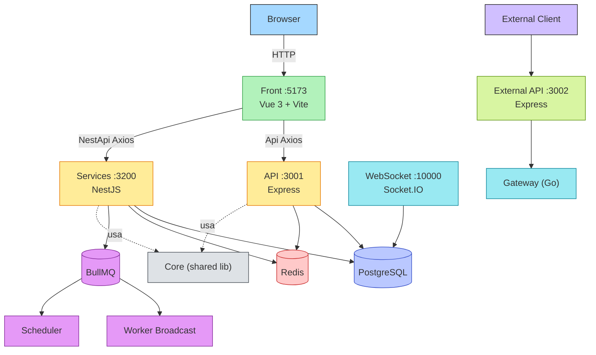

# ChatFunnel — Arquitetura

```mermaid
graph TD
  Browser["Browser"]
  Front["Front :5173<br/>Vue 3 + Vite"]
  API["API :3001<br/>Express"]
  Services["Services :3200<br/>NestJS"]
  PostgreSQL[("PostgreSQL")]
  Redis[("Redis")]
  BullMQ[("BullMQ")]
  WebSocket["WebSocket :10000<br/>Socket.IO"]
  Worker["Worker Broadcast"]
  Scheduler["Scheduler"]
  External["External Client"]
  ExtAPI["External API :3002<br/>Express"]
  Gateway["Gateway (Go)"]
  Core["Core (shared lib)"]

  Browser -->|HTTP| Front
  Front -->|Api Axios| API
  Front -->|NestApi Axios| Services

  API --> PostgreSQL
  API --> Redis
  Services --> PostgreSQL
  Services --> Redis
  Services --> BullMQ

  BullMQ --> Worker
  BullMQ --> Scheduler

  WebSocket --> PostgreSQL

  External --> ExtAPI
  ExtAPI --> Gateway

  API -.->|usa| Core
  Services -.->|usa| Core

  style Front fill:#b2f2bb,stroke:#2f9e44
  style API fill:#ffec99,stroke:#e67700
  style Services fill:#ffec99,stroke:#e67700
  style PostgreSQL fill:#bac8ff,stroke:#364fc7
  style Redis fill:#ffc9c9,stroke:#c92a2a
  style BullMQ fill:#e599f7,stroke:#862e9c
  style WebSocket fill:#99e9f2,stroke:#0c8599
  style Worker fill:#e599f7,stroke:#862e9c
  style Scheduler fill:#e599f7,stroke:#862e9c
  style ExtAPI fill:#d8f5a2,stroke:#5c940d
  style Gateway fill:#99e9f2,stroke:#0c8599
  style Core fill:#dee2e6,stroke:#495057
  style Browser fill:#a5d8ff,stroke:#1e1e1e
  style External fill:#d0bfff,stroke:#1e1e1e
```
