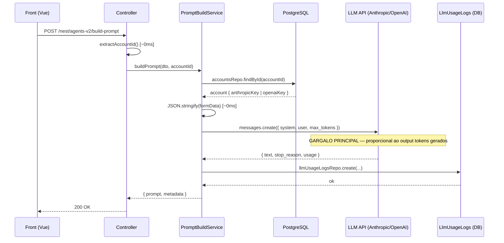
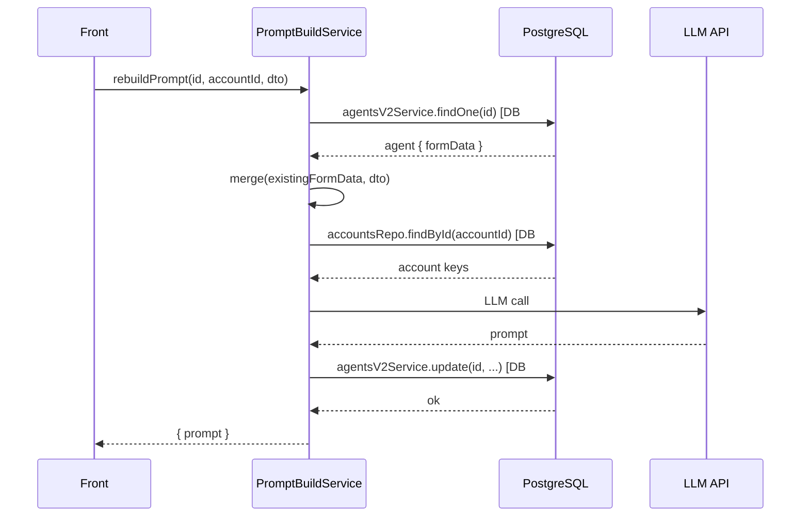

# Agents V2 — Build Prompt

Documenta o fluxo end-to-end da geração do system prompt de um agente v2, os gargalos identificados e as decisões de configuração.

## Arquivos principais

| Arquivo | Responsabilidade |
|---------|-----------------|
| `chatfunnel-front/src/views/agents/AgentsForm/index.vue` | Monta `BuildPromptDto`, chama `AgentsV2Service.buildPrompt()` |
| `chatfunnel-front/src/common/services/AgentsV2Service.js` | POST `/agents-v2/build-prompt` via NestApi |
| `chatfunnel-services/src/modules/agents-v2/agents-v2.controller.ts` | Recebe request, extrai `accountId` |
| `chatfunnel-services/src/modules/agents-v2/prompt-build.service.ts` | Orquestra DB queries + chamada LLM + log de uso |
| `chatfunnel-services/src/modules/agents-v2/agents/prompt-engineer.agent.ts` | Constantes: modelo, `max_tokens`, temperatura |
| `chatfunnel-services/src/modules/agents-v2/prompts/prompt-engineer.md` | Meta-prompt que instrui o LLM a gerar o XML |

## Fluxo — build-prompt (novo agente)



## Fluxo — rebuild-prompt (agente existente)

Tem **3 queries DB seriais** antes da chamada LLM:



## O que o prompt-engineer.md faz

Meta-prompt que transforma os 14 campos do form em **system prompt XML estruturado**.

**Blocos XML gerados (em ordem fixa):**

| Bloco | Campo de entrada | Obrigatório |
|-------|-----------------|-------------|
| `<identity>` | `name`, `role`, `model` | Sempre (name é required) |
| `<objective>` | `objective` | Se preenchido |
| `<business_context>` | `businessContext` | Se preenchido |
| `<reference_data>` | `knowledgeBase` | Se preenchido |
| `<instructions>` | `systemPrompt` + 3 instruções de agência fixas | **Sempre** |
| `<tools>` | `tools[]` | Se array não vazio |
| `<reasoning_approach>` | `reasoning` | Se preenchido |
| `<output_format>` | `outputFormat` | Se preenchido |
| `<examples>` | `examples` | Se preenchido |
| `<constraints>` | `guardrails` | Se preenchido |
| `<final_anchor>` | `anchoring` | Se preenchido |

As 3 instruções de agência injetadas em `<instructions>` são fixas e imutáveis: **Persistência**, **Uso de ferramentas**, **Planejamento**.

## Configurações atuais

```ts
// prompt-engineer.agent.ts
PROMPT_ENGINEER_MODELS = { ANTHROPIC: 'claude-sonnet-4-6', OPENAI: 'gpt-4.1' }
PROMPT_ENGINEER_MAX_TOKENS = 16000   // alterado de 4096 em 2026-06-30
PROMPT_ENGINEER_TEMPERATURE = 0.3
```

> **Por que 16000?** Agentes complexos (ex: Andersson/Mortari Bolico) geravam ~4.5k–5k tokens de output. O limite anterior de 4096 truncava o XML no meio.

**Provider usado para gerar o prompt** (≠ provider do agente em produção):
- Anthropic key na conta → usa `claude-sonnet-4-6` com prompt caching (`cache_control: ephemeral`)
- OpenAI key na conta → usa `gpt-4.1`
- Nenhuma key → `BadRequestException`

## Gargalos

| # | Onde | Impacto | Causa |
|---|------|---------|-------|
| 🔴 1 | **LLM call** | Domina 95%+ do tempo total | Geração proporcional ao output tokens. 16k max → até 120s no Anthropic |
| 🟡 2 | `resolveProviderKey` | ~10–30ms | DB query a cada chamada; resultado nunca muda na sessão |
| 🟡 3 | Rebuild: 2 queries seriais | ~20–60ms | `findOne` + `findById` poderiam rodar em `Promise.all` |
| 🟢 4 | `logUsage` | ~10ms | `await` desnecessário; já é fail-open com try/catch |

## Melhorias pendentes

- [ ] **`stop_reason` check**: detectar truncamento e retornar erro em vez de salvar prompt cortado
  - Anthropic: `response.stop_reason === 'max_tokens'`
  - OpenAI: `response.choices[0].finish_reason === 'length'`
- [ ] **`max_tokens` dinâmico**: calcular `min(model_max_output, context_window - input_tokens - margem)` para não desperdiçar janela nem travar em prompts simples
- [ ] **Cache de `resolveProviderKey`**: evitar DB query repetida por conta
- [ ] **Rebuild paralelo**: `Promise.all([findOne, findById])` em vez de serial

## Estimativas de tempo

Com `max_tokens = 16000`, agente simples (3–4 blocos, ~2k tokens output):
- Anthropic: ~8–15s
- OpenAI: ~5–10s

Agente complexo (todos os blocos, ~5k tokens output):
- Anthropic: ~25–45s
- OpenAI: ~15–30s
