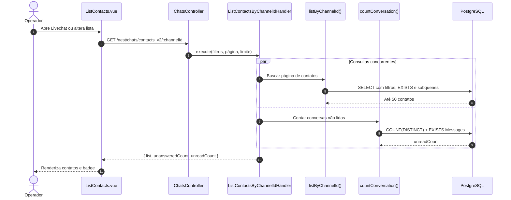
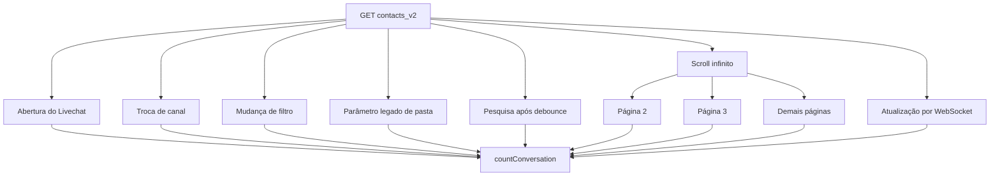
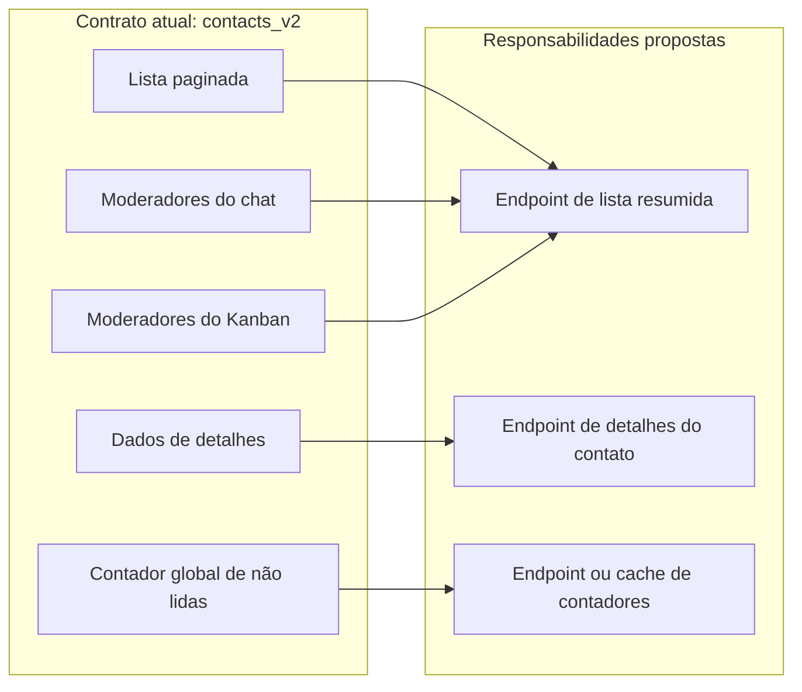
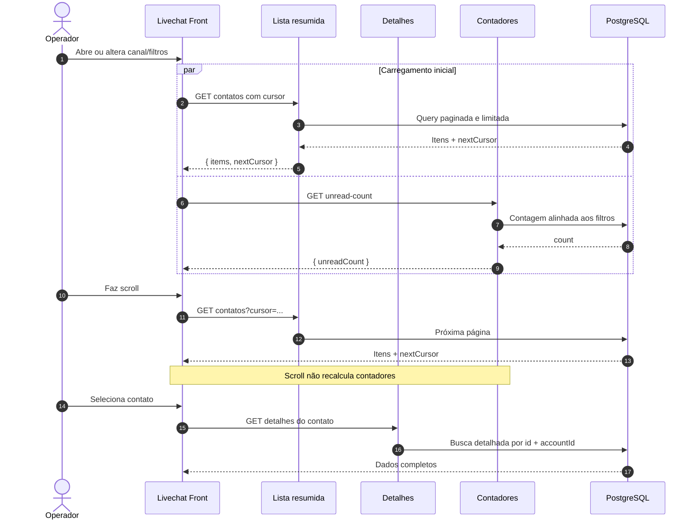
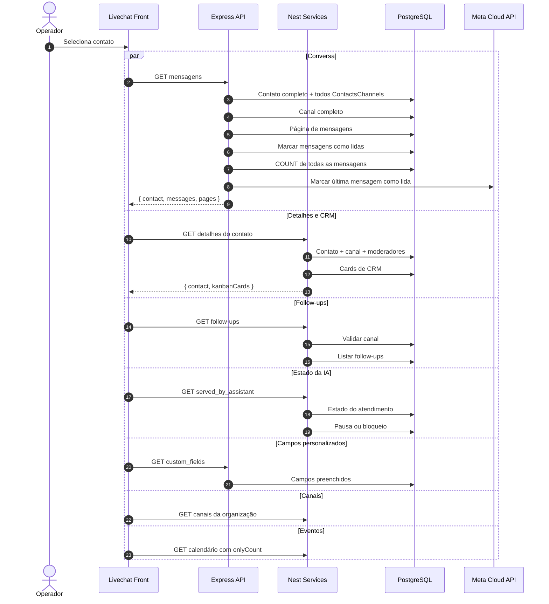
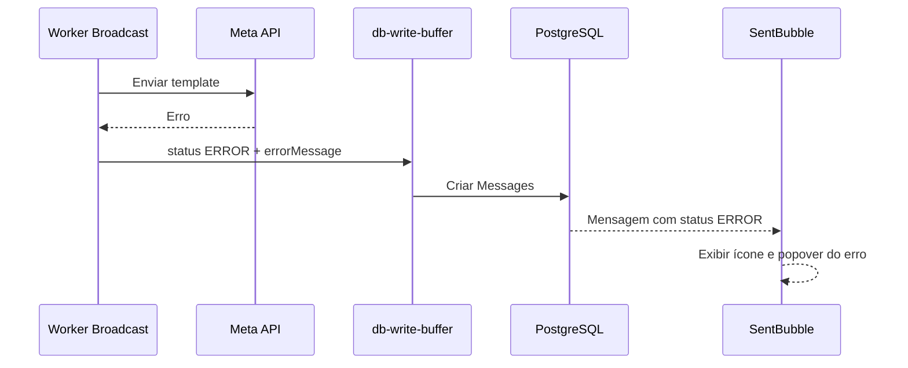
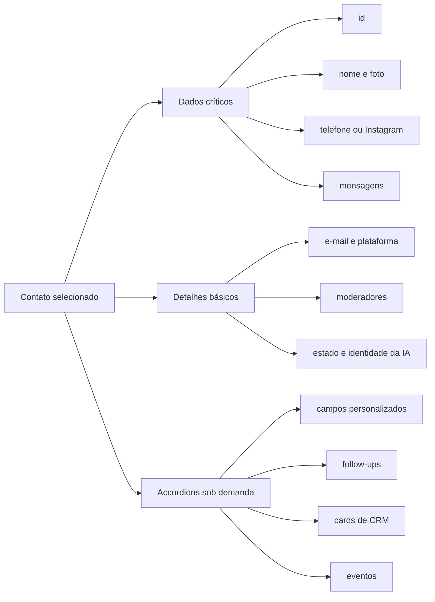

# Livechat — Contratos de Dados e Performance

## Objetivo

Documentar:

- quais dados a lista do Livechat realmente consome;
- onde as consultas são disparadas;
- por que a contagem atual aumenta a pressão no PostgreSQL;
- quais responsabilidades podem ser separadas;
- qual contrato mínimo atende a interface atual.

## Escopo analisado

| Camada | Fonte |
|---|---|
| Front — chamada HTTP | `chatfunnel-front/src/common/services/ChatService.js` |
| Front — lista | `chatfunnel-front/src/views/livechatv2/components/ListContacts/index.vue` |
| Front — item | `chatfunnel-front/src/views/livechatv2/components/ListContacts/components/ContactItem/index.vue` |
| Front — detalhes | `chatfunnel-front/src/views/livechatv2/components/ChatMessages/components/SideBarDetails/index.vue` |
| Services — controller | `chatfunnel-services/src/modules/chat/controllers/chats.controller.ts` |
| Services — handler | `chatfunnel-services/src/modules/chat/commands/list_contacts_by_channelId/handler.ts` |
| Core — queries | `chatfunnel-core/src/repositories/contacts_channels.repository.ts` |

## Fluxo atual



As duas consultas são iniciadas no mesmo `Promise.all`. Uma falha em qualquer uma rejeita a resposta inteira.

## Quando o endpoint é executado



O mesmo contador global é recalculado durante paginação e atualizações em tempo real, mesmo quando seu resultado não depende da página.

## Dados necessários na lista

### Essenciais

| Campo | Uso no front |
|---|---|
| `id` | Seleção, rota e ações |
| `name` | Nome e fallback do avatar |
| `photo` | Avatar |
| `lastUpdate` | Ordenação e horário relativo |
| `isActive` | Badge de contato inativo |
| `isVisualized` | Indicador visual de conversa não lida |
| `transferModeratorId` | Destaque e aceite de transferência |
| `moderatorId` | Avatar do moderador |
| `moderatorName` | Identificação do moderador |
| `kanbanModerators` | Avatares de moderadores do Kanban |
| `servedByAssistant` | Indicador de atendimento por IA |
| `blockedAgent` | Indicador de IA bloqueada |

### Necessários após selecionar o contato

| Campo                  | Uso                              |
| ---------------------- | -------------------------------- |
| `phone`                | Header e envio por WhatsApp      |
| `channelId`            | Ações da conversa                |
| `isArchived`           | Arquivar ou desarquivar          |
| `channelAllocatedType` | Comportamento por tipo de canal  |

Esses campos podem ser obtidos pelo endpoint de detalhes já chamado por `SideBarDetails`.

`folderId` e `folderName` não fazem mais parte do requisito do chat e devem ser removidos do contrato.

### Sem consumo efetivo na lista

| Campo                     | Situação                                            |
| ------------------------- | --------------------------------------------------- |
| `facebookId`              | Selecionado no backend, sem uso encontrado na lista |
| `answeredChat`            | Selecionado no backend, sem uso na renderização     |
| `servedByAssistantId`     | Selecionado, sem uso encontrado                     |
| `servedByAssistantName`   | Selecionado, sem uso encontrado                     |
| `objMessage`              | O front tenta transformar, mas a query não retorna  |
| `unreadCount` por contato | O front sobrescreve com `0`                         |
| `unansweredCount`         | Recebido e armazenado, mas não renderizado          |
| `aiRequestedHuman`        | O front tenta renderizar, mas a query não retorna   |

`answeredChat` representa se a última interação recebida já foi respondida:

- `false`: chegou mensagem do contato e a conversa aguarda resposta;
- `true`: humano, automação, IA ou broadcast enviou uma resposta;
- é diferente de `isVisualized`, que representa leitura ou visualização;
- atualmente só participa do filtro legado `onlyUnanswered`;
- o Livechat atual não renderiza esse estado e não envia `onlyUnanswered`.

## Mapa de responsabilidades



## Divergências da contagem

A query de `countConversation()` não replica integralmente a query da lista:

- o `EXISTS` de `Messages` filtra por `contactId`, mas não por `channelId`;
- as regras de permissões usadas na listagem não são todas aplicadas na contagem;
- alguns filtros possuem condições diferentes entre lista e contador;
- a contagem pode representar contatos que não aparecem para o operador;
- o custo é pago novamente em todas as páginas.

Consequência: o contador pode ser simultaneamente caro e semanticamente diferente da lista exibida.

## Arquitetura proposta



## Contrato mínimo proposto

```ts
interface LivechatContactListItem {
  id: string;
  name: string;
  photo: string | null;
  lastUpdate: string | null;
  isActive: boolean;
  isVisualized: boolean;
  transferModeratorId: string | null;
  moderatorId: string | null;
  moderatorName: string | null;
  kanbanModerators: Array<{ id: string; name: string }>;
  servedByAssistant: boolean;
  blockedAgent: boolean;
}

interface LivechatContactListResponse {
  items: LivechatContactListItem[];
  nextCursor: string | null;
}
```

O contador passa a ter contrato independente:

```ts
interface LivechatUnreadCountResponse {
  unreadCount: number;
}
```

## Fluxo após selecionar um contato

Na primeira seleção, o front pode disparar até sete carregamentos:



### Inventário das chamadas

| Bloco | Endpoint | Momento | Observação |
|---|---|---|---|
| Mensagens | `GET /api/chat/:channelId/:contactId/messages` | Seleção e paginação | Possui leitura e contagem como efeitos colaterais |
| Detalhes + CRM | `GET /nest/chats/contact/:contactId/:channelId` | Seleção | Executa contato e cards sequencialmente |
| Follow-ups | `GET /nest/chats/follow_up_schedule/:channelId/:contactId` | Seleção | Retorna o model completo |
| Estado da IA | `GET /nest/chats/served_by_assistant/:channelId/:contactId` | Montagem e eventos | O front descarta ID e nome da IA |
| Campos personalizados | `GET /api/contacts/:contactId/custom_fields` | Montagem e abertura do accordion | Pode repetir a chamada |
| Canais | Endpoint de canais da organização | Montagem do chat | Não depende do contato |
| Eventos | Endpoint de eventos com `onlyCount` | Carregamento dos detalhes | Conta eventos separadamente |

## Dados para renderizar a conversa

### Identificação imediata do contato

| Campo         | Uso                                       |
| ------------- | ----------------------------------------- |
| `id`          | Buscar mensagens, ações, rota e WebSocket |
| `name`        | Header da conversa                        |
| `photo`       | Avatar do header                          |
| `phone`       | Habilitar envio WhatsApp                  |
| `isActive`    | Bloquear ações para contato inativo       |
| `isArchived`  | Arquivar ou desarquivar                   |
| `channelId`   | Envio, leitura, follow-up e estado da IA  |

Para evitar atraso visual, `id`, `name`, `photo`, `phone` para WhatsApp, `isActive` e `isArchived` podem permanecer no item selecionado. Os demais detalhes podem carregar em paralelo.

O código atual ainda usa `instagramId` como subtítulo do header em `HeaderChat.vue`, mas esse campo não faz parte do requisito desejado e pode ser removido dessa renderização.

### Contrato mínimo de mensagem

| Campo | Uso |
|---|---|
| `id` | Identidade interna e busca complementar de mídia Instagram |
| `messageId` | Cursor da paginação |
| `contactId` | Reply, mídia e contexto |
| `from` | Escolher balão recebido ou enviado |
| `type` | WhatsApp, Instagram ou sistema |
| `objMessage` | Conteúdo variável: texto, mídia, template, reply, sistema e CRM |
| `createdAt` | Ordenação e horário |
| `sentAt` | Horário preferencial de exibição |
| `status` | Erro, atualização de CRM e estado de envio |
| `errorMessage` | Detalhe de falha |
| `reaction` | Reação da mensagem |
| `transcription` | Transcrição de áudio |
| `isObservation` | Nota interna |
| `userId` | Avatar do operador |
| `username` | Nome e tooltip do remetente |
| `sentByAppBusiness` | Identificar mensagem enviada pelo app |
| `assistantId` | Avatar da IA que enviou a mensagem |

O formato interno de `objMessage` continua dependente do tipo da mensagem. Ele deve permanecer como JSON discriminado, validado por `type` e `objMessage.type`.

### Mensagem de broadcast com erro

Fluxo atual:



Para renderizar o estado de erro atual, o front precisa de:

```ts
interface BroadcastErrorMessage {
  id: string;
  messageId: string;
  contactId: string;
  from: "HUMAN";
  type: "WHATSAPP";
  status: "ERROR";
  errorMessage: string | null;
  createdAt: string;
  sentAt: string | null;
  username: string;
  userId: string | null;
  objMessage: BroadcastTemplatePayload | null;
}
```

| Campo | Necessidade |
|---|---|
| `status` | Ativa o ícone vermelho quando é `ERROR` |
| `errorMessage` | Conteúdo do popover |
| `type` | Mantém a mensagem no fluxo WhatsApp |
| `from` | Renderiza como mensagem enviada |
| `createdAt` ou `sentAt` | Horário |
| `messageId` | Cursor da paginação; em erro é gerado um ID sintético |
| `objMessage` | Necessário somente para exibir o template que falhou |
| `broadcastId` | Persistência e rastreabilidade; não é lido pelo Livechat |

O contrato genérico de mensagens já contemplava `status` e `errorMessage`, mas o caso de broadcast possui estes gaps:

- quando a Meta rejeita o envio, `_sendMessageCore()` retorna o erro sem `payload`;
- o worker salva `objMessage: response.payload`, que fica `null` ou `undefined`;
- o Livechat exibe o ícone e o texto do erro, mas não consegue reconstruir o template que falhou;
- `errorMessage` é salvo com `JSON.stringify()`, então o popover pode mostrar JSON bruto;
- não existe no front uma distinção explícita entre erro de broadcast e erro de envio manual;
- `broadcastId` chega na mensagem, mas não participa da renderização.

Se a interface deve mostrar também o template que falhou, o worker precisa persistir o `payloadToReturn` mesmo quando a Meta responde com erro.

### Dados retornados sem consumo na conversa

O endpoint atual retorna todas as colunas de `Messages`. Não foi encontrado consumo direto de:

- `deliveredAt`;
- `readAt`;
- `stepId`;
- `conversationId`;
- `broadcastId`;
- `contabilableOnMetrics`;
- `createdByHistory`;
- relações completas de `contact`, `channel`, `assistant` ou `user`.

O endpoint também retorna `pages`, mas o front controla paginação por `messageId` e não usa esse total.

## Dados para renderizar os detalhes

### Perfil

| Campo | Uso |
|---|---|
| `id` | Identidade e ações |
| `name` | Nome |
| `photo` | Avatar |
| `phone` | Telefone |
| `email` | E-mail |
| `platform` | Plataforma da conversa atual |
| `instagramUsername` | Perfil Instagram |
| `instagramFollowerCount` | Seguidores |
| `instagramFollow` | Se segue o perfil |
| `instagramFollowBusinnes` | Se segue a empresa |
| `isActive` | Bloquear edição e ações |

O backend atual usa `fromPlatform`. Para representar a conversa selecionada, o contrato deve deixar explícito se o campo é a origem do contato ou a plataforma do canal atual.

### Moderadores

```ts
interface ContactModeratorSummary {
  id: string;
  name: string;
  transferModeratorId?: string | null;
}
```

O painel suporta múltiplos moderadores. Para renderização são necessários apenas ID, nome e estado de transferência. Avatar é derivado do ID.

### Atendimento por IA

```ts
interface ContactAssistantState {
  servedByAssistant: boolean;
  assistant: {
    id: string;
    name: string;
  } | null;
  blocked: boolean;
  pausedAt: string | null;
  pausedTimeMinutes: number;
}
```

O backend já retorna `servedByAssistantId` e `servedByAssistantName`, mas `StopAssistant.vue` mantém somente:

- `servedByAssistant`;
- `pausedAt`;
- `pausedTime`.

Assim, o front atualmente sabe se existe atendimento por IA, mas descarta qual IA está atendendo.

### Campos personalizados

```ts
interface ContactCustomFieldValue {
  name: string;
  value: string | number | boolean | null;
  system: boolean;
  folder: {
    name: string;
  } | null;
}
```

Para renderização, o front usa:

- nome do campo;
- valor;
- nome da pasta;
- flag `system` para agrupar como “Sistema”.

### Follow-ups

```ts
interface ContactFollowUpSummary {
  id: string;
  scheduleDate: string;
  createdAt: string;
  typeAnswer: "PENDING" | "ANSWER" | "UNANSWER" | "CANCELED";
}
```

O front usa somente esses quatro campos para listar, posicionar junto às mensagens e cancelar um follow-up.

### Cards de CRM

```ts
interface ContactCrmCardSummary {
  id: string;
  createdAt: string;
  priority: string | null;
  statusOportunity: "OPEN" | "WON" | "LOST";
  kanban: {
    id: string;
    name: string;
    columns: Array<{
      id: string;
      name: string;
      color: string | null;
    }>;
  };
  column: {
    id: string;
    name: string;
  };
  moderators: Array<{
    id: string;
    user: {
      id: string;
      name: string;
    };
  }>;
  lossReason: {
    id: string;
    name: string;
  } | null;
}
```

Para renderização, `description` e `position` não são utilizados. Eles atualmente acompanham o objeto durante algumas atualizações porque o front espalha o card completo no payload.

## Contrato agregado proposto para detalhes

```ts
interface LivechatContactDetailsResponse {
  contact: {
    id: string;
    name: string;
    photo: string | null;
    phone: string | null;
    email: string | null;
    platform: string;
    isActive: boolean;
    instagram?: {
      username: string | null;
      followerCount: number;
      followsProfile: boolean;
      followsBusiness: boolean;
    };
  };
  moderators: ContactModeratorSummary[];
  assistantState: ContactAssistantState;
  customFields: ContactCustomFieldValue[];
  followUps: ContactFollowUpSummary[];
  crmCards: ContactCrmCardSummary[];
}
```

Esse contrato representa uma visão de leitura. A implementação pode continuar separando blocos lentos ou carregados sob demanda, desde que o front tenha contratos explícitos.

## Estratégia de carregamento dos detalhes



Sugestão de prioridade:

1. Renderizar imediatamente dados críticos vindos do item da lista.
2. Buscar mensagens sem retornar contato completo nem contar todas as páginas.
3. Buscar perfil, moderadores e IA em uma visão de detalhes.
4. Carregar campos personalizados, CRM e eventos apenas quando o accordion correspondente for aberto.
5. Manter follow-ups junto da conversa somente se os marcadores entre mensagens continuarem ativos.

## Problemas encontrados nos contratos atuais

- `getContactChannelById()` não seleciona `photo` nem `isActive`, embora o painel tente renderizar esses campos.
- O endpoint de mensagens retorna o contato completo e todos os `contactsChannels`, duplicando o endpoint de detalhes.
- A consulta de mensagens executa `COUNT` em cada página, mas `pages` não é usado.
- A leitura de mensagens faz `updateMany` por contato sem restringir `channelId`.
- O detalhe do contato busca cards depois do contato, de forma sequencial.
- `findCardsByContactId()` recebe somente `contactId`; o filtro explícito por `accountId` não aparece nessa query.
- O endpoint de estado da IA recebe `Account-Selected`, mas o handler não propaga `accountId` às queries.
- O endpoint de campos personalizados filtra inicialmente apenas por `contactId`.
- O front consulta `field.system` para criar o grupo “Sistema”, mas o endpoint de campos personalizados não seleciona nem retorna essa flag.
- Campos personalizados são carregados na montagem e podem ser carregados novamente ao clicar no accordion.
- O front possui label para `ANSWERED`, enquanto o enum persistido de follow-up usa `ANSWER`.
- ID e nome da IA já chegam do backend, mas são descartados pelo front.
- `transferModeratorId` está em `ChatModerators`, que não possui `channelId`; a transferência fica associada ao contato inteiro, não à conversa do canal.
- `setTransferModerator()` atualiza todas as linhas de `ChatModerators` do contato, enquanto a limpeza filtra `moderatorId`; isso pode deixar valores residuais em outras linhas.

### Remoção das pastas do chat

As pastas de `ContactsFolders` não fazem mais parte do Livechat. Permanecem como código legado:

- o front envia `folder=no-folder` por padrão na listagem;
- o watcher da rota ainda reage a mudanças de `folder`;
- a query da lista filtra `Contacts.folderId`;
- a query seleciona `folderId`, faz join com `ContactsFolders` e retorna `folderName`;
- a contagem também aplica filtro por pasta;
- o endpoint de detalhes ainda seleciona `contact.folder`;
- `FolderInput`, estado local e eventos relacionados continuam no painel, embora o template esteja comentado.

O agrupamento `folder` dos campos personalizados é outro conceito e deve permanecer.

## Prioridades

1. Remover `countConversation()` do `Promise.all` da listagem.
2. Não recalcular contadores durante scroll infinito ou refresh silencioso.
3. Alinhar filtros, canal e permissões da contagem com a lista.
4. Reduzir o `SELECT` ao contrato mínimo.
5. Substituir paginação por `OFFSET` por cursor baseado em `lastUpdate` e `id`.
6. Medir separadamente duração da lista e da contagem.

## Critérios de validação

- abrir a lista executa no máximo uma query de listagem;
- scroll carrega somente a próxima página;
- contador não é executado durante paginação;
- contador respeita `accountId`, `channelId`, permissões e filtro;
- os badges e avatares continuam sendo renderizados;
- selecionar o contato carrega os dados completos pelo endpoint de detalhes;
- eventos do WebSocket atualizam localmente o item conhecido antes de solicitar refresh.
